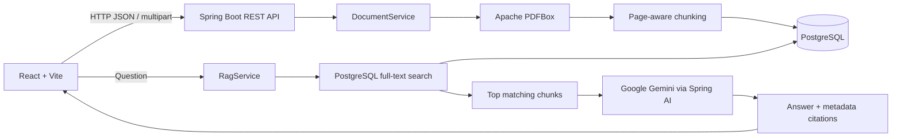
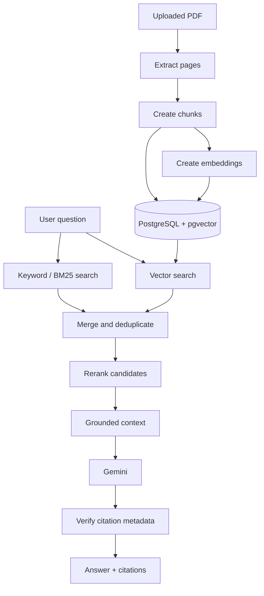

# Hybrid RAG Knowledge Assistant

A beginner-friendly, production-inspired document question-answering application built with Spring Boot, React, PostgreSQL, Spring AI, and Google Gemini.

The application lets a user upload PDF documents and ask questions about their contents. Answers are generated from retrieved document text and include the filename and page number used as sources.

> **Current status:** The repository contains a working MVP using PostgreSQL full-text search. Embeddings, pgvector, vector search, hybrid score fusion, and reranking are deliberately kept as the next extension so the first version remains easy to understand and run.

## What It Does

```text
PDF upload
    |
    v
Extract text page by page with PDFBox
    |
    v
Split pages into overlapping chunks
    |
    v
Store chunks and page metadata in PostgreSQL
    |
    v
Search chunks with PostgreSQL full-text search
    |
    v
Send the best chunks to Gemini
    |
    v
Return a grounded answer and citations
```

If no matching document text is found, the application returns:

```text
I could not find this information in the uploaded documents.
```

## Architecture

### Implemented MVP



### Planned hybrid architecture

The long-term architecture described by the project name is shown below. It is not falsely presented as already implemented.



## Why These Technologies?

| Technology | Role |
|---|---|
| Java 21 | Application language and runtime target |
| Spring Boot | REST API, dependency injection, configuration, and web server |
| Spring AI | Spring-friendly integration with Gemini chat models |
| Google Gemini | Generates the final answer from retrieved context |
| Apache PDFBox | Extracts text from PDF pages while preserving page numbers |
| PostgreSQL | Stores documents and extracted chunks |
| PostgreSQL full-text search | Simple keyword retrieval for the MVP |
| React + Vite | Upload and chat user interface |

### Why is this called RAG?

RAG means **Retrieval-Augmented Generation**:

1. **Retrieval:** Search the uploaded documents for relevant text.
2. **Augmentation:** Add the retrieved text to the model prompt.
3. **Generation:** Ask Gemini to write an answer using that context.

The model does not receive the entire database. It receives only the chunks selected for the current question.

### Why keep citations in the database?

Every chunk stores:

- The document ID
- The original filename
- The page number
- The chunk number
- The chunk text

The answer text comes from Gemini, but the citations come from application-controlled metadata. This prevents the model from inventing page numbers or document names.

## Repository Structure

```text
.
├── pom.xml
├── mvnw.cmd
├── README.md
├── .env.example
├── src/main/java/com/example/ragassistant
│   ├── controller
│   │   ├── ChatController.java
│   │   ├── DocumentController.java
│   │   └── HealthController.java
│   ├── exception
│   │   └── GlobalExceptionHandler.java
│   ├── model
│   │   ├── ChatRequest.java
│   │   ├── ChatResponse.java
│   │   ├── Citation.java
│   │   ├── DocumentResponse.java
│   │   └── UploadResponse.java
│   ├── repository
│   │   └── DocumentRepository.java
│   └── service
│       ├── DocumentService.java
│       └── RagService.java
├── src/main/resources
│   ├── application.yml
│   └── schema.sql
└── frontend
    ├── package.json
    ├── vite.config.js
    └── src
        ├── App.jsx
        └── styles.css
```

## Prerequisites

- Java 21 or newer
- PostgreSQL 14 or newer
- Node.js and npm
- A Google AI Studio Gemini API key

The project currently targets Java 21. A newer Java runtime can compile and run it, but Java 21 is the recommended local version.

## PostgreSQL Setup

Install PostgreSQL locally, then create the application database:

```sql
CREATE DATABASE rag_assistant;
```

The application runs [schema.sql](src/main/resources/schema.sql) at startup and creates:

- `documents`: uploaded document records
- `document_chunks`: extracted text, page numbers, and PostgreSQL search vectors

The MVP does not require the pgvector extension yet.

## Configuration

Copy [.env.example](.env.example) as a reference. Set the variables in PowerShell:

```powershell
$env:GEMINI_API_KEY = "your_google_ai_studio_key"
$env:DB_URL = "jdbc:postgresql://localhost:5432/rag_assistant"
$env:DB_USERNAME = "postgres"
$env:DB_PASSWORD = "your_postgres_password"
```

Never commit a real API key or database password.

The application reads these values through [application.yml](src/main/resources/application.yml). Gemini is configured with the current Spring AI Google GenAI starter and the `ChatClient` API.

## Run the Backend

From the repository root:

```powershell
.\mvnw.cmd spring-boot:run
```

The API runs on:

```text
http://localhost:8080
```

Run the backend tests:

```powershell
.\mvnw.cmd test
```

## Run the Frontend

Keep the backend running and open another PowerShell terminal:

```powershell
Push-Location frontend
npm install
npm run dev
Pop-Location
```

Open the Vite URL displayed in the terminal, normally:

```text
http://127.0.0.1:5173/
```

The Vite proxy forwards `/api` requests to the Spring Boot server.

## REST API

### Health

```http
GET /api/health
```

Response:

```json
{
  "status": "UP"
}
```

### Upload a PDF

```http
POST /api/documents/upload
Content-Type: multipart/form-data
```

PowerShell example:

```powershell
Invoke-RestMethod `
  -Uri http://localhost:8080/api/documents/upload `
  -Method Post `
  -Form @{ file = Get-Item .\employee_handbook.pdf }
```

Example response:

```json
{
  "documentId": 1,
  "filename": "employee_handbook.pdf",
  "pages": 20,
  "chunks": 24
}
```

### List documents

```http
GET /api/documents
```

### Ask a grounded question

```http
POST /api/chat/rag
Content-Type: application/json
```

Request:

```json
{
  "question": "What is the company's annual leave policy?"
}
```

Response:

```json
{
  "answer": "Employees are entitled to 20 paid leave days per calendar year.",
  "citations": [
    {
      "document": "employee_handbook.pdf",
      "page": 14,
      "chunkId": "document-1-chunk-2"
    }
  ]
}
```

## Important Implementation Details

### PDF processing

`DocumentService` reads each PDF page separately with PDFBox. It splits the page text into chunks of approximately 700 words with 100 words of overlap. The overlap helps preserve meaning when an answer spans a chunk boundary.

### Retrieval

`DocumentRepository` uses PostgreSQL's generated `tsvector` column and a GIN index. The user's question is converted into a PostgreSQL `plainto_tsquery`, and the highest-ranked matching chunks are returned.

This is keyword retrieval, not semantic vector retrieval. Searching for exact terms works well, but a future vector search layer will improve questions that use different words with the same meaning.

### Grounding

`RagService` builds a prompt containing:

- The user's question
- The retrieved chunks
- A strict instruction to use only those chunks
- A fixed fallback response when the answer is unsupported

Gemini does not generate citation metadata. The application creates citations from the retrieved database rows.

## Roadmap

1. Add integration tests using a temporary PostgreSQL database.
2. Add Gemini-compatible embeddings.
3. Enable PostgreSQL `pgvector` and semantic similarity search.
4. Combine vector and keyword results with simple score fusion.
5. Add reranking and metadata filters.
6. Add evaluation questions for retrieval and citation correctness.
7. Add conversation memory after document Q&A is reliable.
8. Add agent tools only after the RAG workflow is stable.

## Troubleshooting

### Database connection refused

Make sure PostgreSQL is running and that `DB_URL`, `DB_USERNAME`, and `DB_PASSWORD` match the local installation.

### Gemini configuration error

Make sure `GEMINI_API_KEY` is set in the same PowerShell session used to run Spring Boot.

### No relevant information found

Confirm that the PDF contains selectable text. Scanned image-only PDFs need OCR before PDFBox can retrieve their text.
